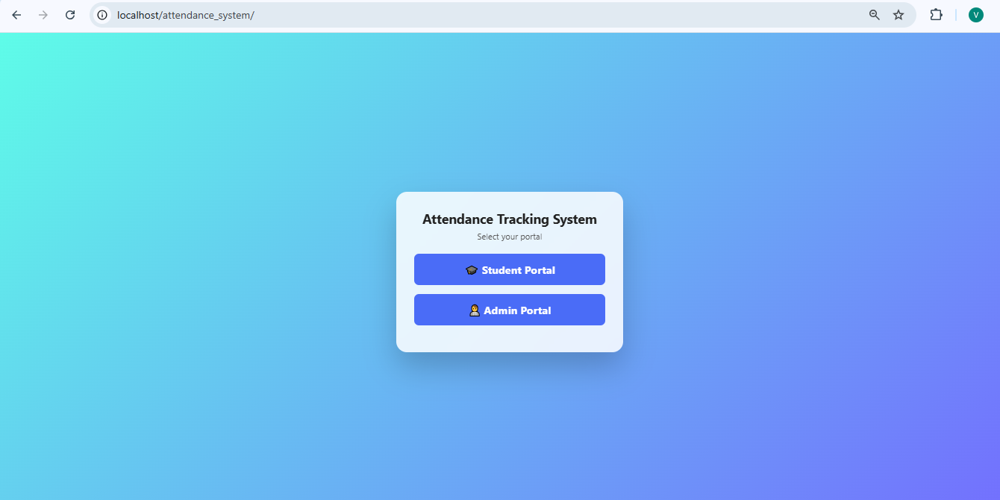
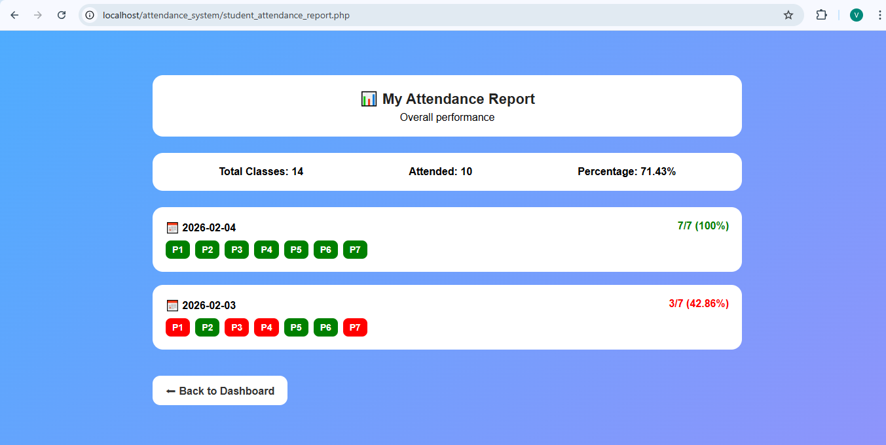

# Attendance Management System

A web-based Attendance Management System developed using PHP, MySQL, HTML, and CSS.  
This system provides separate modules for Admin and Student to manage and view attendance efficiently.


## Features

- Admin Login  
- Student Login  
- Add Students  
- Take Attendance (Date-wise / Period-wise)  
- View Attendance Reports  
- Secure Logout  

---

## Technologies Used

   ### Frontend: HTML, CSS


   ### Backend: PHP


   ### Database: SQL

   ### Server: XAMPP (Apache & MySQL)


---
### Project Structure
```
attendance_system/
├── index.php
│
├── student_login.php
├── student_dashboard.php
├── student_attendance_report.php
│
├── take_attendance.php
├── take_attendance_periodwise.php
│
├── admin_login.php
├── admin_dashboard.php
├── add_student.php
│
├── db.php
├── logout.php
├── style.css
│
└── screenshots/
    ├── homepage.png
    ├── student_login.png
    ├── attendance_report.png
    ├── periodwise_attendance.png
    ├── admin_login.png
    ├── admin_dashboard.png
    └── admin_controls.jpeg
```

---

## How to Run the Project (Localhost)

1. Download XAMPP:  
https://www.apachefriends.org/

2. Copy the project folder to:  
C:\xampp\htdocs\Attendance-System

3. Start Apache and MySQL in XAMPP Control Panel

4. Open phpMyAdmin:  
http://localhost/phpmyadmin

5. Create a database named:  
attendance_system

6. Configure database connection in db.php

7. Open the project in browser:  
http://localhost/Attendance-System/

---

## Execution Screenshots

### Homepage


### Student Login


### Attendance Report


### Take Attendance



### Admin Login


### Admin Dashboard


### Admin Controls


